Ion Community App
=================

🚀 Overview
-----------

The **Ion Community App** is a cutting-edge Kotlin Multiplatform Mobile (KMP) application designed to streamline community management. This app lets users book services, track activities, and receive real-time notifications—all from a single, intuitive platform. Explore its key features and technologies that make it stand out!

🌟 Key Features
---------------

*   **📅 Service Booking**: Effortlessly manage and book community services.
*   **🔔 Notifications**: Receive instant updates and important messages.
*   **📊 Activity Tracking**: Stay up-to-date with the latest activities and events.
*   **💳 Payments**: Conveniently manage and pay your checks.
*   **🛠️ Service History**: Keep track of all service requests and their status.
*   **👥 Invite Friends**: Easily invite friends to join and participate in the community.
*   **🎥 Camera Monitoring**: Keep an eye on the compound with integrated camera monitoring.
*   **📋 Advertisements**: Stay informed about the latest ads and announcements.
*   **📂 Personal Profile**: Update and manage your personal profile within the app.
*   **🏗️ Developer Projects**: Discover and engage with other exciting projects by the compound developer.
*   **🌐 Multi-Language Support**: Easily switch between different languages for better accessibility.
*   **🎛️ Settings & Preferences**: Customize app settings to suit your preferences.
*   **🔒 Biometric Authentication**: Ensure secure access with fingerprint or face recognition.

🛠️ Technologies Used
---------------------

*   **Kotlin Multiplatform Mobile (KMP)**: For a unified codebase across Android and iOS.
*   **Jetpack Compose**: Modern UI toolkit for building native Android UIs.
*   **Koin**: Simple yet effective dependency injection.
*   **Ktor**: Versatile HTTP client for network operations.
*   **Coil**: Powerful image loading library for Android.
*   **SQLDelight**: Robust local database management.
*   **KMPNotifier**: Cross-platform notifications for both iOS and Android.
*   **Biometric Authentication**: Secure login using fingerprint or face recognition.

📸 Screenshots
--------------

Below are some screenshots showcasing the app’s features:

    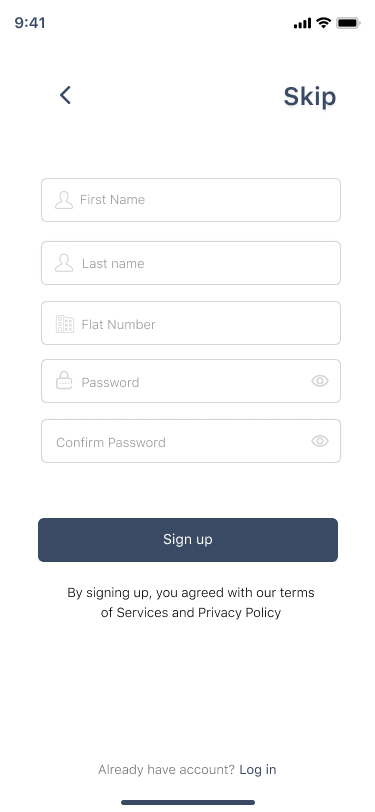
    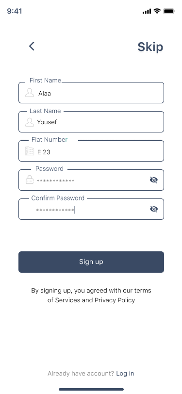
    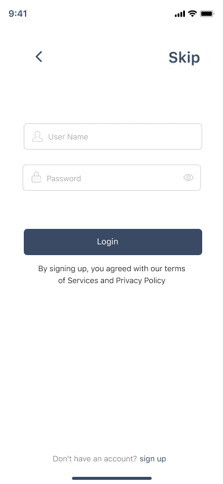
    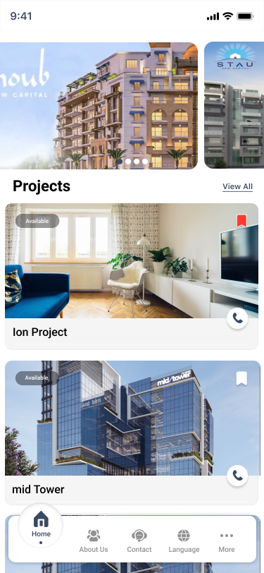
    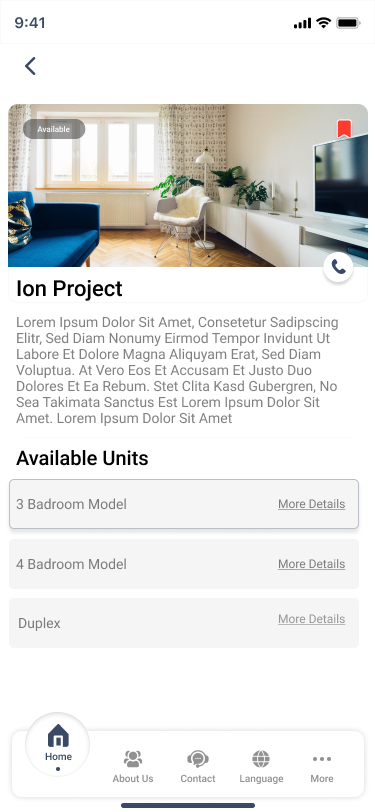
    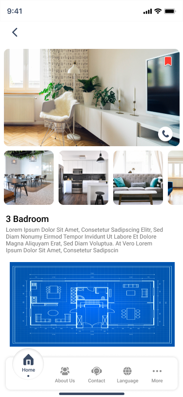
    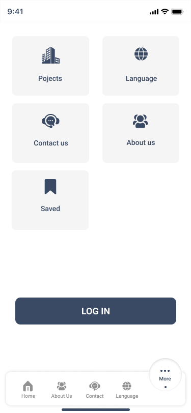
    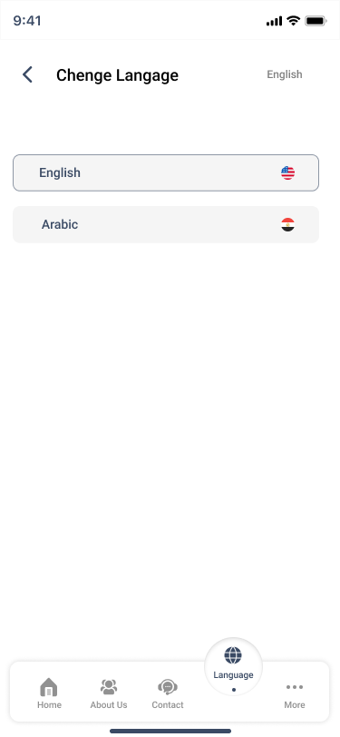
    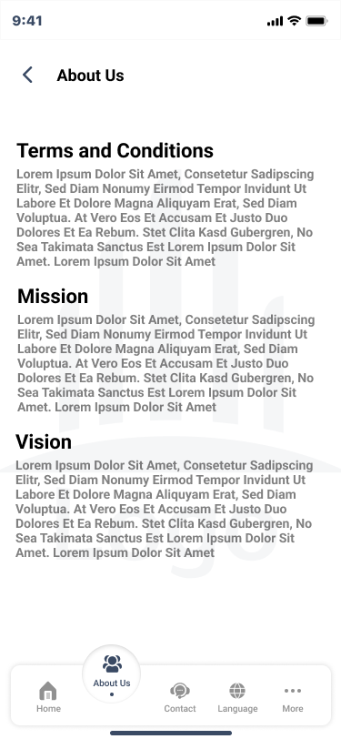
    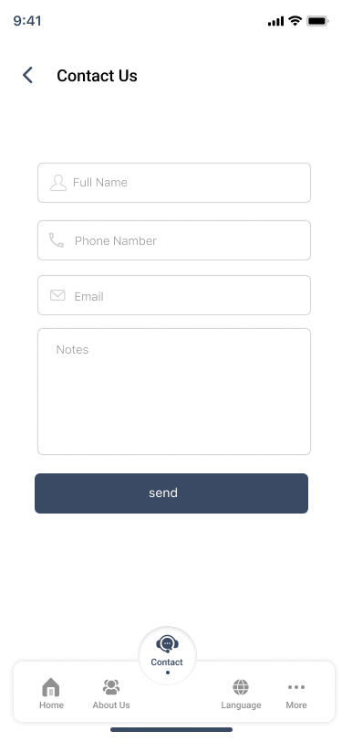
    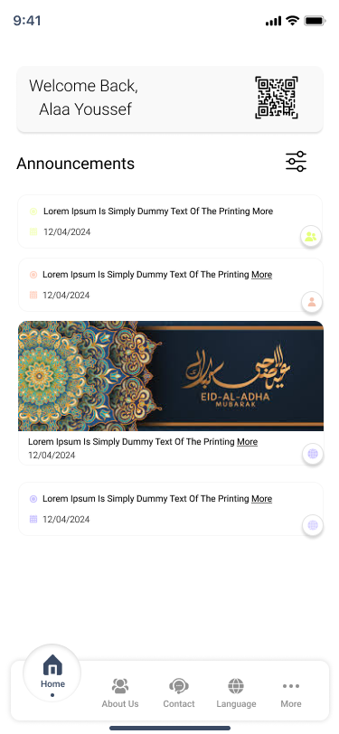
    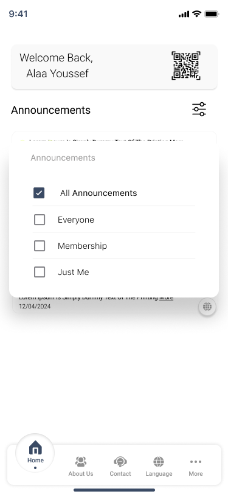
    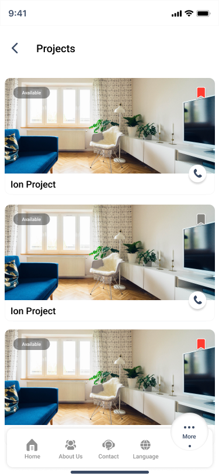
    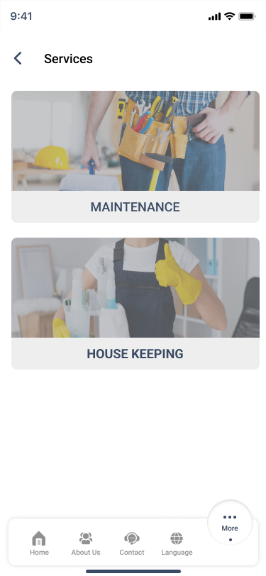
    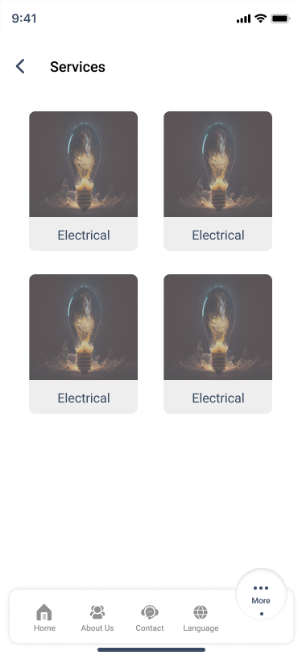
    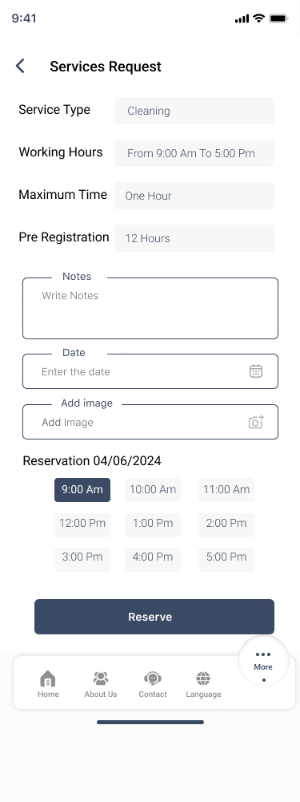
    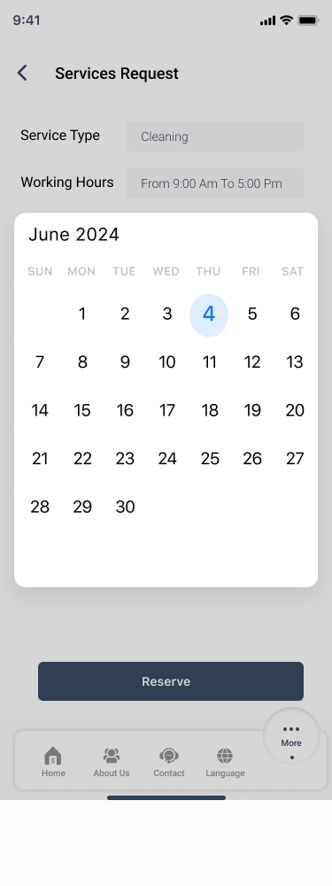
    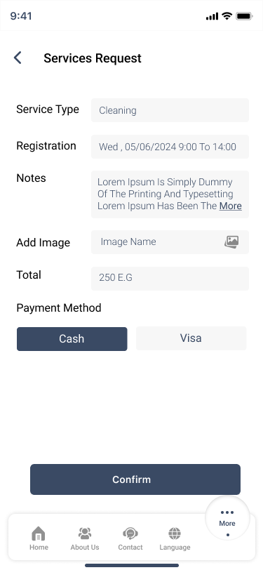
    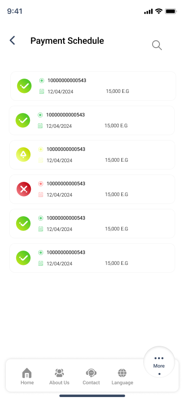
    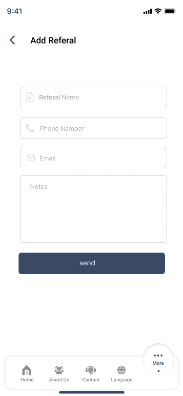
    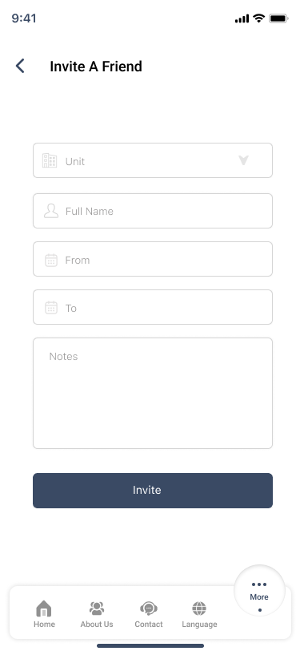
    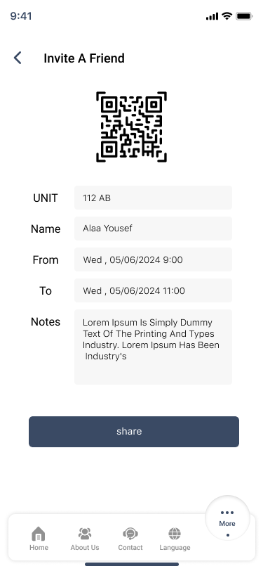
    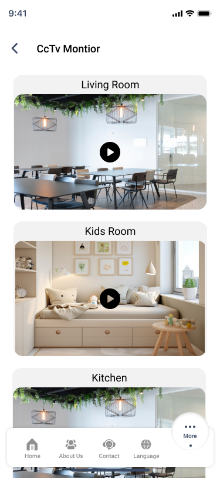
    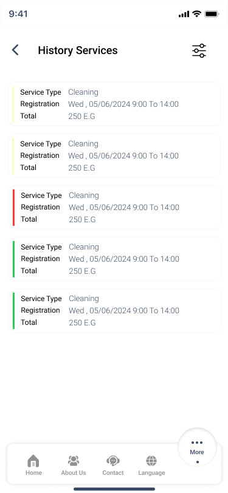
    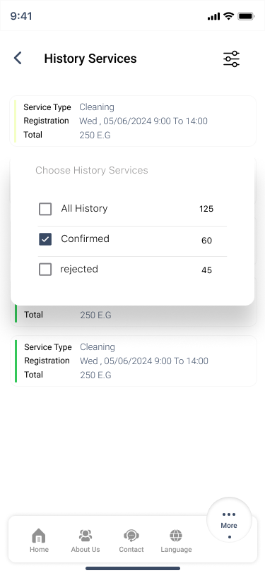

📬 Contact
----------

For more information or specific inquiries, please reach out to the project maintainers.

* * *

Feel free to adjust the text as needed to better match your app's branding and style!
